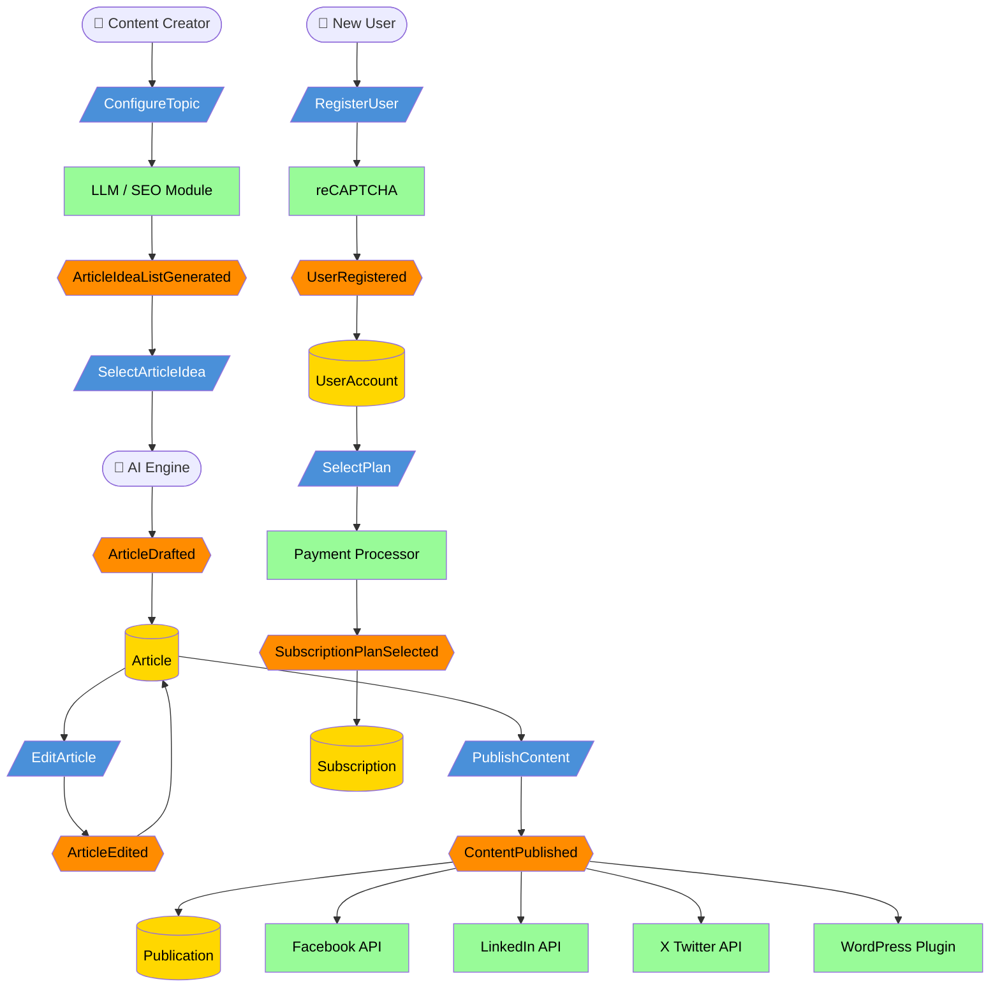

## Floowe Event Storming – Mermaid Diagrams

### 1. AS-IS flow 

```mermaid
flowchart TD
    %% Actors
    NU([👤 New User])
    CC([👤 Content Creator])
    AI([🤖 AI Engine])

    %% Commands
    C1[/RegisterUser/]
    C2[/SelectPlan/]
    C3[/ConfigureTopic/]
    C4[/SelectArticleIdea/]
    C5[/EditArticle/]
    C6[/PublishContent/]

    %% Domain Events
    E1{{UserRegistered}}
    E2{{SubscriptionPlanSelected}}
    E3{{ArticleIdeaListGenerated}}
    E4{{ArticleDrafted}}
    E5{{ArticleEdited}}
    E6{{ContentPublished}}

    %% Aggregates
    A1[(UserAccount)]
    A2[(Subscription)]
    A3[(Article)]
    A4[(Publication)]

    %% External Systems
    S1[reCAPTCHA]
    S2[Payment Processor]
    S3[LLM / SEO Module]
    S4[Facebook API]
    S5[LinkedIn API]
    S6[X Twitter API]
    S7[WordPress Plugin]

    %% Flow
    NU --> C1 --> S1 --> E1 --> A1
    A1 --> C2 --> S2 --> E2 --> A2
    CC --> C3 --> S3 --> E3
    E3 --> C4 --> AI --> E4 --> A3
    A3 --> C5 --> E5 --> A3
    A3 --> C6 --> E6 --> A4

    E6 --> S4
    E6 --> S5
    E6 --> S6
    E6 --> S7

    %% Styles
    style E1 fill:#FF8C00,color:#000
    style E2 fill:#FF8C00,color:#000
    style E3 fill:#FF8C00,color:#000
    style E4 fill:#FF8C00,color:#000
    style E5 fill:#FF8C00,color:#000
    style E6 fill:#FF8C00,color:#000

    style C1 fill:#4A90D9,color:#fff
    style C2 fill:#4A90D9,color:#fff
    style C3 fill:#4A90D9,color:#fff
    style C4 fill:#4A90D9,color:#fff
    style C5 fill:#4A90D9,color:#fff
    style C6 fill:#4A90D9,color:#fff

    style A1 fill:#FFD700,color:#000
    style A2 fill:#FFD700,color:#000
    style A3 fill:#FFD700,color:#000
    style A4 fill:#FFD700,color:#000

    style S1 fill:#98FB98,color:#000
    style S2 fill:#98FB98,color:#000
    style S3 fill:#98FB98,color:#000
    style S4 fill:#98FB98,color:#000
    style S5 fill:#98FB98,color:#000
    style S6 fill:#98FB98,color:#000
    style S7 fill:#98FB98,color:#000
```

---

### 2. TO-BE (Proposed Features)

```mermaid
flowchart TD
    %% Actors
    CC([👤 Content Creator])
    WA([👤 Workspace Admin])
    ED([👤 Editor])
    AI([🤖 AI Engine])
    EX([🔗 External Systems])

    %% F1 Scheduler
    subgraph F1[" F1: AI Content Scheduler"]
        C_SCH[/SchedulePublication/]
        E_SCH{{ContentScheduled}}
        E_PUB{{ScheduledPostPublished}}
        E_FAIL{{ScheduleFailed}}
        SVC_Q[Queue / Cron Service]
        C_SCH --> E_SCH --> SVC_Q --> E_PUB
        SVC_Q --> E_FAIL
    end

    %% F2 Analytics
    subgraph F2[" F2: Performance Analytics"]
        C_STAT[/FetchArticleStats/]
        E_STAT{{ArticleStatsUpdated}}
        E_SYNC{{SocialMetricsSynced}}
        GSC[Google Search Console]
        FBi[Facebook Insights]
        C_STAT --> E_STAT --> GSC
        E_STAT --> E_SYNC --> FBi
    end

    %% F3 Teams
    subgraph F3[" F3: Multi-User Workspace"]
        C_WS[/CreateWorkspace/]
        C_INV[/InviteMember/]
        C_APP[/ApproveContent/]
        E_WS{{WorkspaceCreated}}
        E_INV{{TeamMemberInvited}}
        E_APP{{ContentApproved}}
        C_WS --> E_WS
        C_INV --> E_INV
        C_APP --> E_APP
    end

    %% F4 Image AI
    subgraph F4[" F4: AI Image Auto-Selection"]
        C_IMG[/GenerateImageSuggestions/]
        E_IMG{{ImageSuggestionsGenerated}}
        E_SEL{{ImageSelectedForArticle}}
        UNSPLASH[Unsplash / DALL·E API]
        C_IMG --> AI --> E_IMG --> UNSPLASH
        E_IMG --> E_SEL
    end

    %% F5 Marketplace
    subgraph F5[" F5: Integration Marketplace"]
        C_CON[/ConnectIntegration/]
        E_CON{{IntegrationConnected}}
        E_WHK{{WebhookTriggered}}
        ZAPIER[Zapier / HubSpot / Mailchimp]
        C_CON --> E_CON --> ZAPIER
        E_CON --> E_WHK --> EX
    end

    %% Actor connections
    CC --> C_SCH
    CC --> C_STAT
    CC --> C_IMG
    CC --> C_CON
    WA --> C_WS
    WA --> C_INV
    ED --> C_APP

    %% Policy: After ContentPublished → trigger F1, F4, F5
    TRIGGER([ContentPublished Event]) --> F1
    TRIGGER --> F4
    TRIGGER --> F5

    %% Styles - Events orange
    style E_SCH fill:#FF8C00,color:#000
    style E_PUB fill:#FF8C00,color:#000
    style E_FAIL fill:#FF4444,color:#fff
    style E_STAT fill:#FF8C00,color:#000
    style E_SYNC fill:#FF8C00,color:#000
    style E_WS fill:#FF8C00,color:#000
    style E_INV fill:#FF8C00,color:#000
    style E_APP fill:#FF8C00,color:#000
    style E_IMG fill:#FF8C00,color:#000
    style E_SEL fill:#FF8C00,color:#000
    style E_CON fill:#FF8C00,color:#000
    style E_WHK fill:#FF8C00,color:#000

    %% Commands blue
    style C_SCH fill:#4A90D9,color:#fff
    style C_STAT fill:#4A90D9,color:#fff
    style C_WS fill:#4A90D9,color:#fff
    style C_INV fill:#4A90D9,color:#fff
    style C_APP fill:#4A90D9,color:#fff
    style C_IMG fill:#4A90D9,color:#fff
    style C_CON fill:#4A90D9,color:#fff

    %% External systems green
    style GSC fill:#98FB98,color:#000
    style FBi fill:#98FB98,color:#000
    style UNSPLASH fill:#98FB98,color:#000
    style ZAPIER fill:#98FB98,color:#000
    style SVC_Q fill:#DDA0DD,color:#000

    style TRIGGER fill:#FF8C00,color:#000,stroke:#FF4500,stroke-width:2px
```

